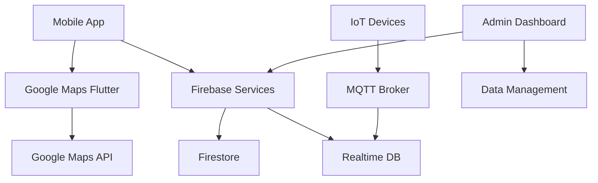

# Live Campus Mapping System - Implementation Plan

## Overview
This document outlines the implementation plan for creating a comprehensive live campus mapping system with directions, multi-level support, and real-time facility tracking for Mbarara University of Science & Technology.

## Data Models

### Location Model
```dart
class Location {
  final String id;
  final String name;
  final String type; // 'classroom', 'office', 'facility', 'parking', 'entrance'
  final String campus; // 'Main Campus', 'North Campus', 'Medical Campus'
  final String building;
  final String floor; // 'Ground Floor', 'First Floor', etc.
  final String? room; // Room number, nullable for outdoor locations
  final double latitude;
  final double longitude;
  final int level; // Numeric level for indoor navigation (0 = ground, 1 = first floor, etc.)
  final String description;
  final List<String> facilities; // ['wifi', 'projector', 'computers', 'wheelchair_accessible']
  final String status; // 'active', 'maintenance', 'closed', 'under_construction'
  final DateTime lastUpdated;
  final Map<String, dynamic>? metadata; // Additional custom data

  Location({
    required this.id,
    required this.name,
    required this.type,
    required this.campus,
    required this.building,
    required this.floor,
    required this.latitude,
    required this.longitude,
    required this.level,
    this.room,
    this.description = '',
    this.facilities = const [],
    this.status = 'active',
    DateTime? lastUpdated,
    this.metadata,
  }) : lastUpdated = lastUpdated ?? DateTime.now();

  // Factory constructor for Firestore
  factory Location.fromMap(Map<String, dynamic> map) {
    return Location(
      id: map['id'] ?? '',
      name: map['name'] ?? '',
      type: map['type'] ?? 'facility',
      campus: map['campus'] ?? 'Main Campus',
      building: map['building'] ?? '',
      floor: map['floor'] ?? 'Ground Floor',
      room: map['room'],
      latitude: map['latitude'] ?? 0.0,
      longitude: map['longitude'] ?? 0.0,
      level: map['level'] ?? 0,
      description: map['description'] ?? '',
      facilities: List<String>.from(map['facilities'] ?? []),
      status: map['status'] ?? 'active',
      lastUpdated: map['lastUpdated'] != null
          ? DateTime.parse(map['lastUpdated'])
          : DateTime.now(),
      metadata: map['metadata'],
    );
  }

  Map<String, dynamic> toMap() {
    return {
      'id': id,
      'name': name,
      'type': type,
      'campus': campus,
      'building': building,
      'floor': floor,
      'room': room,
      'latitude': latitude,
      'longitude': longitude,
      'level': level,
      'description': description,
      'facilities': facilities,
      'status': status,
      'lastUpdated': lastUpdated.toIso8601String(),
      'metadata': metadata,
    };
  }
}
```

### Facility Model
```dart
class Facility {
  final String id;
  final String name;
  final String type; // 'equipment', 'vehicle', 'personnel', 'service'
  final String locationId; // Reference to Location
  final double? latitude; // For mobile facilities, nullable
  final double? longitude;
  final int? level; // For mobile facilities
  final String status; // 'operational', 'maintenance', 'moving', 'out_of_service'
  final DateTime lastSeen;
  final String? trackerId; // IoT tracker identifier
  final Map<String, dynamic>? metadata; // Additional properties
  final DateTime lastUpdated;

  Facility({
    required this.id,
    required this.name,
    required this.type,
    required this.locationId,
    this.latitude,
    this.longitude,
    this.level,
    this.status = 'operational',
    DateTime? lastSeen,
    this.trackerId,
    this.metadata,
    DateTime? lastUpdated,
  }) :
    lastSeen = lastSeen ?? DateTime.now(),
    lastUpdated = lastUpdated ?? DateTime.now();

  // Factory constructor for Firestore
  factory Facility.fromMap(Map<String, dynamic> map) {
    return Facility(
      id: map['id'] ?? '',
      name: map['name'] ?? '',
      type: map['type'] ?? 'equipment',
      locationId: map['locationId'] ?? '',
      latitude: map['latitude'],
      longitude: map['longitude'],
      level: map['level'],
      status: map['status'] ?? 'operational',
      lastSeen: map['lastSeen'] != null
          ? DateTime.parse(map['lastSeen'])
          : DateTime.now(),
      trackerId: map['trackerId'],
      metadata: map['metadata'],
      lastUpdated: map['lastUpdated'] != null
          ? DateTime.parse(map['lastUpdated'])
          : DateTime.now(),
    );
  }

  Map<String, dynamic> toMap() {
    return {
      'id': id,
      'name': name,
      'type': type,
      'locationId': locationId,
      'latitude': latitude,
      'longitude': longitude,
      'level': level,
      'status': status,
      'lastSeen': lastSeen.toIso8601String(),
      'trackerId': trackerId,
      'metadata': metadata,
      'lastUpdated': lastUpdated.toIso8601String(),
    };
  }

  // Check if facility is currently at its assigned location
  bool get isAtAssignedLocation => latitude == null && longitude == null;
}
```

## System Architecture

### Technology Stack
- **Frontend**: Flutter with google_maps_flutter plugin
- **Backend**: Firebase Firestore (data storage), Firebase Realtime Database (live tracking)
- **Mapping**: Google Maps Platform (Directions API, Places API)
- **Authentication**: Firebase Auth (for admin features)
- **IoT Integration**: MQTT protocol for device communication

### Component Diagram


## Implementation Phases

### Phase 1: Foundation (Week 1-2)
1. Create data models (Location, Facility)
2. Set up Firebase collections structure
3. Implement basic CRUD operations for locations
4. Create location service class

### Phase 2: Basic Mapping (Week 3-4)
1. Replace custom map with Google Maps
2. Implement location markers with clustering
3. Add location search and filtering
4. Create location details view

### Phase 3: Multi-Level Support (Week 5-6)
1. Implement floor switching UI
2. Add indoor map overlays
3. Create building-specific navigation
4. Implement level-based filtering

### Phase 4: Directions & Routing (Week 7-8)
1. Integrate Google Directions API
2. Implement indoor pathfinding algorithm
3. Add turn-by-turn navigation
4. Create route visualization

### Phase 5: Live Tracking (Week 9-10)
1. Set up IoT device integration
2. Implement real-time location updates
3. Add facility status monitoring
4. Create tracking dashboard

### Phase 6: Advanced Features (Week 11-12)
1. AR navigation integration
2. Accessibility features (wheelchair routes)
3. Offline map support
4. Analytics and reporting

## Key Features Implementation

### Multi-Level Campus Map
- **Floor Selector**: Dropdown or segmented control for floor selection
- **Building Overlays**: Custom polygons for building footprints
- **Indoor Maps**: SVG overlays or tile overlays for indoor layouts
- **Level Transitions**: Smooth transitions between floors

### Directions & Navigation
- **Outdoor Routing**: Google Maps Directions API
- **Indoor Routing**: A* pathfinding on floor plan graphs
- **Waypoints**: Support for multi-stop routes
- **Accessibility**: Routes avoiding stairs, preferring ramps

### Live Facility Tracking
- **GPS Trackers**: For vehicles and mobile equipment
- **BLE Beacons**: For fixed equipment location
- **Status Updates**: Real-time operational status
- **Geofencing**: Automatic status updates based on location

## Data Collection Strategy

### Initial Data Population
1. **Campus Survey**: GPS coordinates for all buildings and outdoor locations
2. **Floor Plans**: Digitize existing blueprints into GIS format
3. **Facility Inventory**: Catalog all trackable assets
4. **Beacon Deployment**: Install BLE beacons in key locations

### Ongoing Maintenance
1. **Admin Tools**: Web dashboard for location/facility management
2. **Mobile Data Collection**: App for on-site updates
3. **Automated Updates**: IoT sensor data ingestion
4. **Crowdsourcing**: User-reported location corrections

## API Integration Plan

### Google Maps Platform
- **Maps SDK**: For map display and markers
- **Directions API**: For routing calculations
- **Places API**: For location search and details
- **Geocoding API**: For address-to-coordinate conversion

### Firebase Services
- **Firestore**: Document storage for locations and facilities
- **Realtime Database**: Live tracking data
- **Cloud Functions**: Server-side processing for complex operations
- **Storage**: Floor plan images and map tiles

## Security & Privacy Considerations

### Data Protection
- Location data anonymization for privacy
- Role-based access control for admin features
- Secure IoT device communication
- GDPR compliance for user data

### Access Control
- Public access for basic map viewing
- Authenticated access for detailed directions
- Admin-only access for data management
- API key protection for external services

## Testing Strategy

### Unit Testing
- Data model validation
- Service layer functionality
- Algorithm correctness (pathfinding)

### Integration Testing
- API integrations (Google Maps, Firebase)
- IoT device communication
- Cross-platform compatibility

### User Acceptance Testing
- Navigation accuracy validation
- Performance testing with large datasets
- Accessibility compliance testing

## Deployment Plan

### Staging Environment
- Firebase project for testing
- Limited user access for beta testing
- Performance monitoring setup

### Production Rollout
- Gradual feature rollout
- User training and documentation
- Support system for issues

### Monitoring & Maintenance
- Real-time performance monitoring
- Automated data quality checks
- Regular updates for map data accuracy

## Success Metrics

### Technical Metrics
- Map load time < 3 seconds
- Navigation accuracy > 95%
- Real-time update latency < 5 seconds

### User Metrics
- User engagement (daily active users)
- Navigation success rate
- User satisfaction scores

### Business Metrics
- Reduced wayfinding support requests
- Improved facility utilization tracking
- Enhanced campus user experience

## Risk Mitigation

### Technical Risks
- GPS accuracy in dense urban areas
- Indoor positioning challenges
- IoT device reliability

### Operational Risks
- Data collection resource requirements
- Ongoing maintenance costs
- User adoption challenges

### Mitigation Strategies
- Hybrid positioning systems
- Phased implementation approach
- Comprehensive user training
- Regular system audits

## Budget Considerations

### Development Costs
- Google Maps API usage fees
- IoT hardware and deployment
- Development team resources

### Operational Costs
- Cloud infrastructure (Firebase)
- API usage monitoring
- Maintenance and updates

### ROI Projections
- Time savings for campus navigation
- Improved operational efficiency
- Enhanced user satisfaction

## Conclusion

This implementation plan provides a comprehensive roadmap for creating a state-of-the-art live campus mapping system. The phased approach ensures manageable development cycles while delivering incremental value to users. The combination of modern mapping technologies, IoT integration, and robust data management will create a scalable solution that can grow with the university's needs.